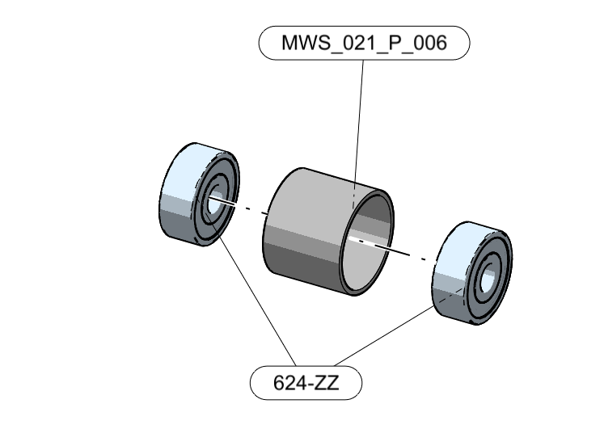
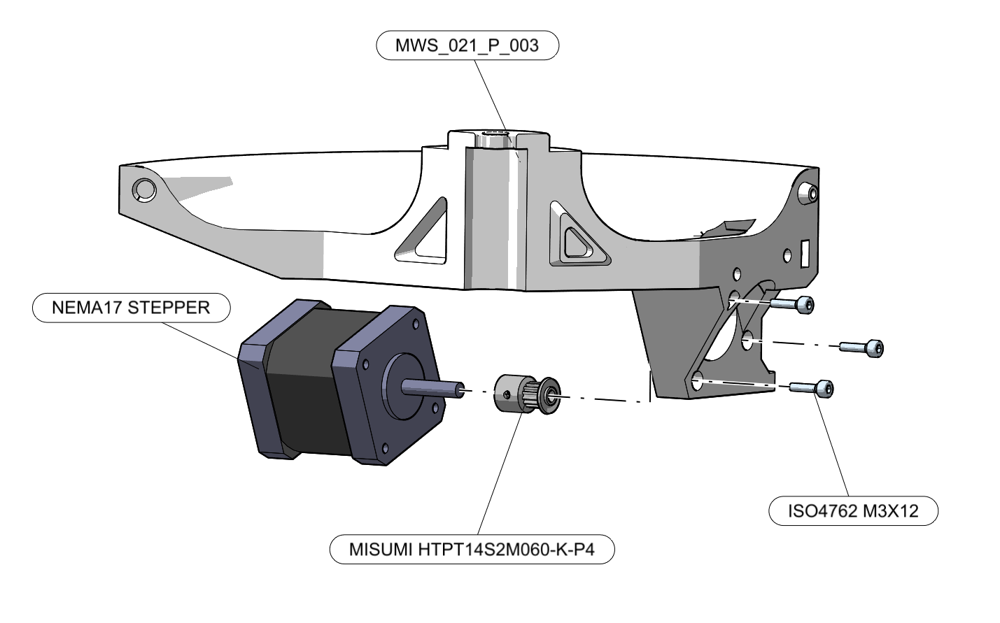
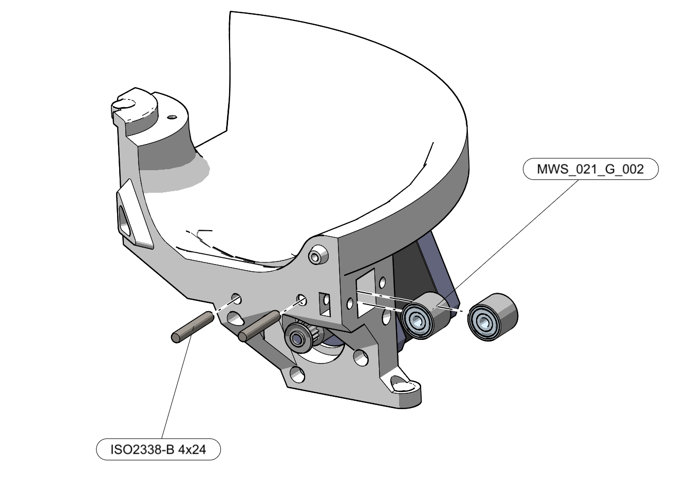
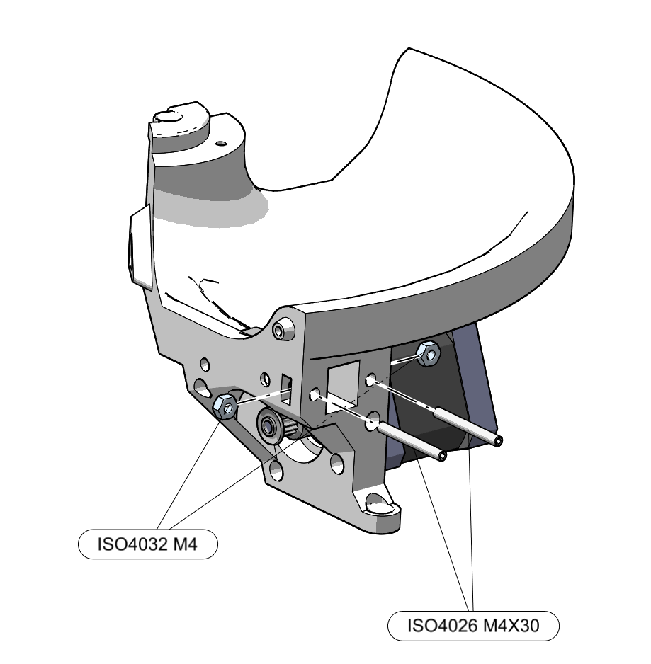
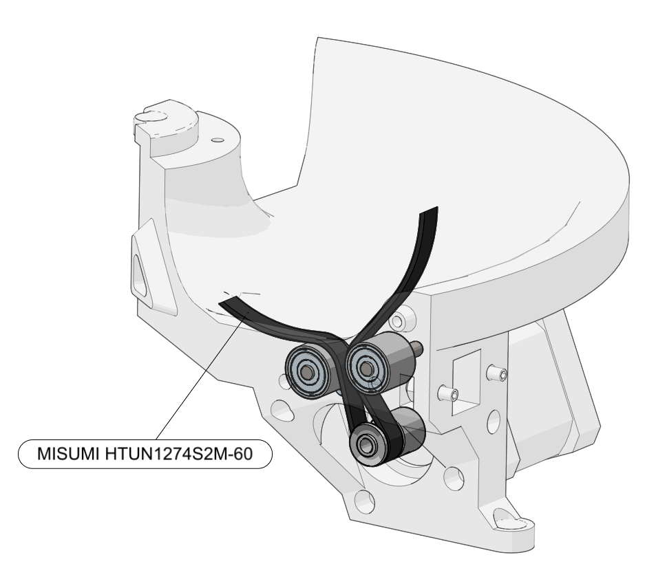
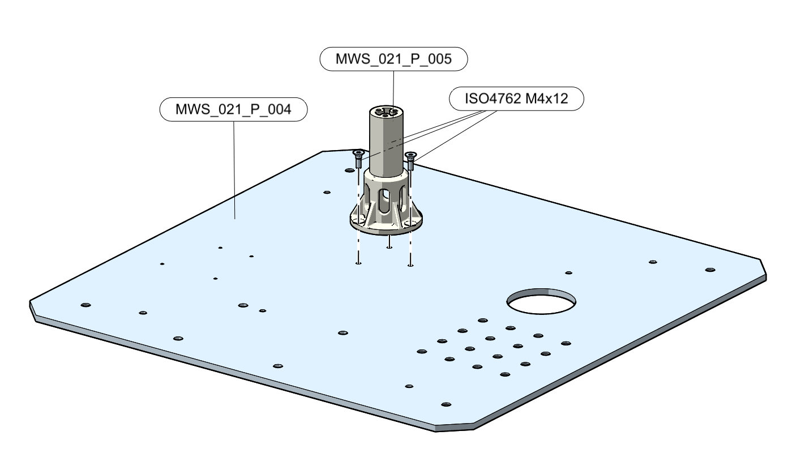
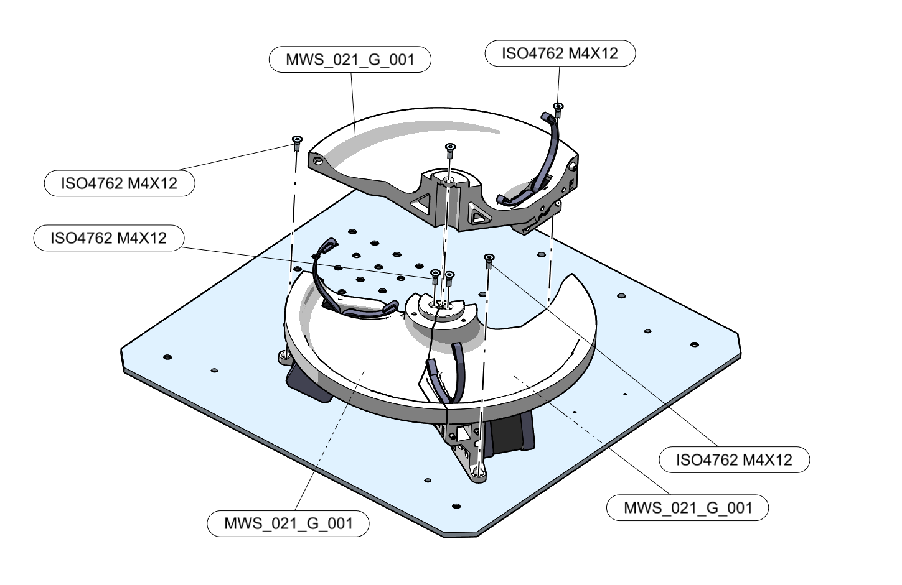
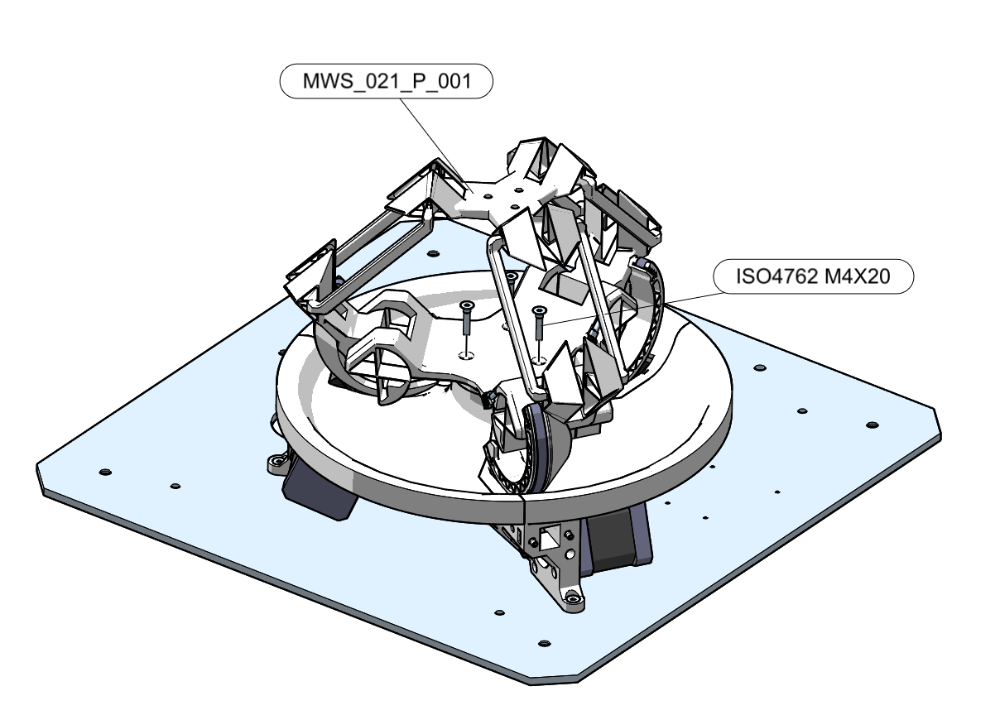

# DeltaFlex assembly instructions

## Before you begin

Note: The assembly of the cover and of the driving electronics are left out of the current assembly as one might want to make the covers in a different way or use different driving electronics.

## Assembly sequence

1. After sourcing all components start by assembling the six `MWS_021_G_002` sub-assemblies.

1. Proceed to the assembly of the three `MWS_021_G_001` by:
   1. assemblies by assembling the stepper motors.
   

   1. Insert bearing groups and fix with pins

   1. Assemble tensioner set screws and nuts

   1. Route the timing belt through its path between the rollers and the driving shaft

Leave the belt "free".
1. Mount the central support part on the base

1. Mount the three actuator groups `MWS_021_G_001` on the base

1. Finally mount the *DeltaFlex* mechanism on the support structure

When doing so take care to route the cables of the limit switches through their deignated path through the centre of the central support part to the driving electronics
1. attach the belt end to the driven pulley
1. tighten the belt appropriately by screwing the tensioning screws
1. if the timing belt is too long remove a few teeth and repeat the belt tensioning step