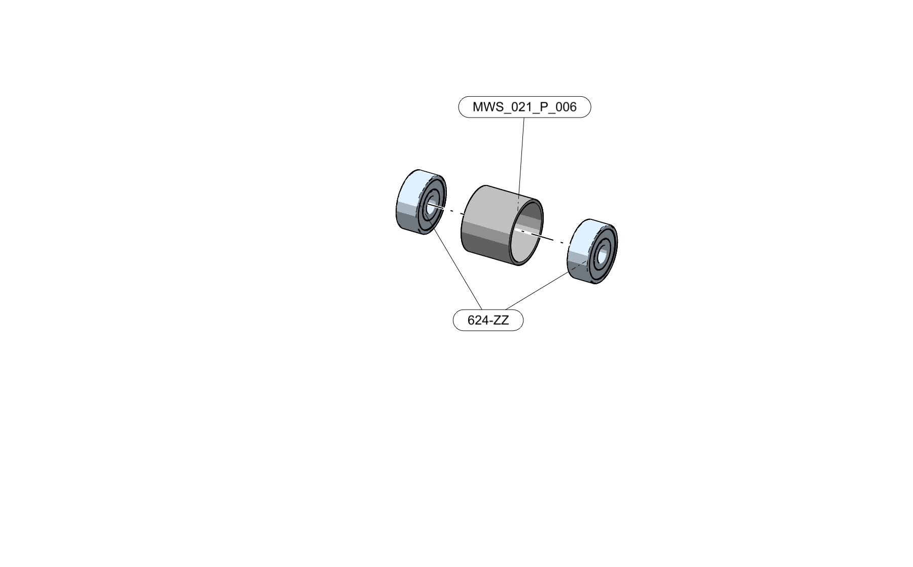

# DeltaFlex assembly instructions

1. After sourcing all components start by assembling the six `MWS_021_G_002` sub-assemblies.

2. Proceed to the assembly of the three `MWS_021_G_001` assemblies by assembling the stepper motors.

